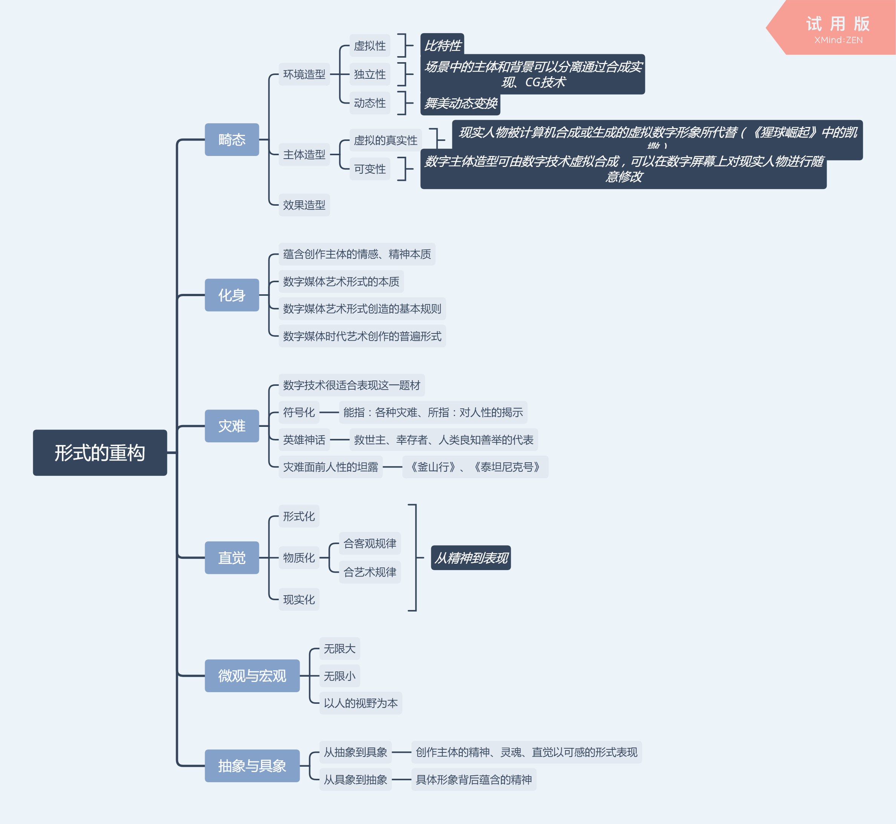

[TOC]

#	第三章	形式的重构

#### #数字技术对艺术的影响

摘：	数字技术不仅为我们的艺术活动提供了全新的创作平台，并且刷新了艺术创造和艺术审美的方式。尤其是影视，只有想不到，没有做不到的；影视艺术不仅可以拍出来，更可以做出来；影视艺术不仅能够被观赏，更可以被体验能、参与——围绕计算机设备注入高清、DV等科技成果的不断更新换代，虚拟、创意、互动、视听冲击等新的美学属于也毋庸置疑地成为当代影视艺术创作的核心理念。

****

摘：	建立在计算机技术大发展基础上的数字媒体艺术，以二进制数据为基本单元，运用计算机计算生成前所未有的数字影像，其全新的影像生成方式和过程，向我们展开了一幅艺术形式的别样图景。在数字媒体艺术中。枝术的解放使艺术挣开了物质和现实表象的束缚，令其尤为自由灵话地进人纯粹的心灵意象领域。

#### #在未来，人是否会被技术操纵？

摘：	数字技术的强大生成与制造能力所体现的并非数字技术本身的力量。而是我们支配它、调度它、使用它的力量。这种力量并不来自外部，而是来自艺术创作主体内心巨大的精神张力和膨服的精神欲求，它是我们创作化身形式的动力，  也是化身作为艺术形式的存在价值和意义。

####	#虚拟社区

 摘：	在网络虚拟社区等场所，每一个进入的人都有一个化名——ID 或者昵称，也许这个ID或昵称就是其真名实姓，但一旦他进入虚拟社区，所有跟他往的人并不在乎这是否是真名实姓，而只是将之视为一个代码。在交往的过程中，虚拟社区的人能够相互感受到其中的真切和现实性，但这种真切和现实性却与其现实生活中的真切和现实性没有对应关系，哪怕事实上是有的，但设有人会太追究这些。

#### #数字技术对艺术创作的积极影响

摘：	由于数字技术创造了前所未有的无比自由的“画布"，无限灵动的“画笔”，创作者由此得以抛却传统艺术物质材料的种种局限和束缚，将自觉意象的本初形态以确定的形式视觉地呈现出来。

​	