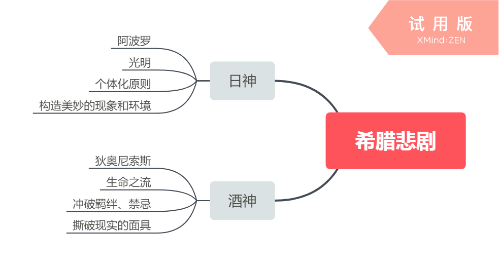

[TOC]

#	第二章	理念的重构

+ 现实

+ 真实

+ 丑

+ 主体

+ 情感

+ 体验

  摘：	随着技术的进一步发展，客观世界是否与我们生存的距离正在迅速拉开甚至消失？数字化影响是否正在篡改生命与生命之间的自然接触？技术在艺术创作中的全面渗透是否会导致主体地位的消解？当代数字技术的发展后成了美学研究必不可少的物质基础，也带来了诸多的问题。数字技术构建的虚拟现实在某种程度上比现实还要生动，这迫使人们不得不重新书写虚拟与现实、真实与假定、物质世界与精神世界、再现与表现这样一些美学理念。

  #	第一节	现实

  ###	#VR

Virtual Reality（虚拟现实）使用计算机生成一个逼真的三维视觉、听觉】触觉等感觉世界，让用户产生一种沉浸其中的“浸没感”，并利用设备对这一生成的虚拟世界进行浏览和交互。

####	#实拍与动画特效之间的关系（虚拟与现实）？

+ 互补

+ 动画更适合做场景，不适合做人

+ 实拍是动画的基础

+ 最后落脚点——二者孰重孰轻不重要，都是为了艺术创作内容更加精致。。。。。。

  

##  第二节    真实

摘：	虚拟现实的终极目标，是要创造一个让人难辨真假的场景，这就是要让感觉器官接受到一个与真实发出的同样的信号，来诱使大脑和相信自己处于一个真实的环境中。

+ 感官系统接收信号
+ 技术营造真实感（仿真）
+ 防止沉浸

####  #数字技术对人的影响（消极）

摘：	我们也许不必担心母体的囚禁，那种将肉体紧紧束缚，仅剩下意识在电脑支配下自以为是的生活，尚停留在幻想的彼岸。但是，在遥远的将来，当虚拟现实技术被推到极致，某些时候你也许会为辨别真假而费神。而当我们的感知能力飞跃了躯体的地平线，会不会被机器永远拽在手里？如果，当第n代的VR系统可以展现给我们太多虚拟幻境般的奇异世界，当游戏让我们在虚拟环境中哭泣欢笑、肆意撒野，我们能否有足够的分辨力和自制力，在某一时刻大声叫道：“我知道这不是真的，暂停！”

观点：

1. 人的感官是多种多样的，技术想要做到完全的仿真环境还有很长的路要走。
2. 技术创造的初衷是让生活变得更加美好，让创作更加便捷。我们应该去把控技术而不是被技术把控，技术不会凌驾于人类之上。

##  第三节    丑

###	 一、搞笑：审丑的日常化

时下流行的“搞笑”特质

1. 扭曲  	将人物性格特点放大，阿Q的“国骂”、唐吉坷德的盔甲和长矛、大力水手的健硕肌肉，吸引眼球。
2. 晾丑         将人性丑陋的一面赤裸裸地晾出来，如好色、贪财、季度、自私等，满足公众心理，却不管对人的心灵造成的影响。
3. 调侃         加入方言、俚语等
4. 无厘头     
5. 恶搞         

##  二、丑和丑感

####	#审美和审丑

​	毕达哥拉斯提出“美是和谐”，那么对和谐的破坏就是丑的。丑是美的存在的反面，丑感是人对丑的存在的心理和情感体验。

​	从没感到丑感的拓展，表现了人的审美能力的发展和完善。如果一个人只能鉴赏美而没有能力鉴赏丑，那么这个人的审美能力就是残缺不全的，犹如亚里士多德所说的“脆弱的”观众。”丑“使我们看到了感性世界丰富多彩的面貌，”审丑“使我们换取另一个角度审视人生另一层的意蕴。

​	对“丑“的接受和认识标志着人性的成长、心灵的成熟，对”丑“的欣赏说明心灵的接受、爆肉量的扩大，它不仅是耳目感官的进步，更是心灵耐受力和分辨力的提高，是人的审美能力的复杂化。

####	#想象（联系艺术学）

摘：	创造（艺术）形象的关键在于人的想象力。想象是审美活动发生的必要条件，它使感知超出自身，使理解走向形式，使情感构造出一个多样化的幻想世界。从想象真实，到真实的想象，想象一开始便贯穿在感知里。想象把某些经验或体验提出来进行回忆、联想、类比、期待，把脑中一些模模糊糊的意识逐渐变得明确；想象既与个别事物有关联，又是主动支配性的，具有综合统一性的感性活动。

****

摘：	古典艺术所以想追求的教化与娱乐价值在现代艺术中逐渐演化为或者一味的求变猎奇、反叛否定（后现代主义），或者个性化的表达与交流价值；古典艺术所倡导的艺术的责任感使命感被消解，现代艺术在商品化的大潮中被赋予更多的游戏精神、自适情怀；古典艺术所追求的表达的合情合理和逻辑的有机联系以及完整形态也被肢解成反语法的支离破碎的话语形式，或浅白流俗，或专事修饰。现代艺术让艺术的创造有了更多的机械式技术性拼贴与制造的成分。

###	三、丑的境界

“丑”有三种境界

1. 与性格契合的丑
2. 与作品的艺术风格相契合的丑
3. 与人类情感相契合的丑

##  第四节    主体

数媒作品的特性：

+ 制作性
+ 复制性
+ 展示性

摘：  艺术创作的主体作为美学研究的重要理念，其范畴被很大程度上泛化和扩大化了，每-个掌握数字技术的人都有可能成为艺术创作的主体，面传统的需要经过f专门的训练才能作为艺术创作主体而存在的理念被简便易行的技术于段所颠覆了。   

#### #科学（家）与艺术（家）的联系

摘：	实际上很难看出科学的思象与艺术的想象有什么本质的区别，科学家和艺术家同样拥有直觉、灵感、情感、欲望、想象力、创造力、自我意识、自主意识等这些人类引以为豪的素质。他们的性格气质也同样影响着他们的科学发明或艺术创作的风格。

​	科学与艺术的区别。科学研主要指针对物质世界的，虽然身无科学也研究人，但主要是研究人的物质组成和生理结构。相比之下艺术则更关注人。人的精神世界和人类的命运。科学的最该境界是物质的结构美，是简洁的逻辑美。

****

摘：	海德格尔说:“存在的本质在于它的存在。这个存在者为之存在的那个存在，总是我的存在。只是通过人的存在，其他事物才得以醒示自己，人的存在是其他事物存在的先决条件。”海德格尔是要强调**人的存在对于世界的重要性。**

####	#何为好的艺术作品

摘：	对艺术创作的主体而言。其创造括动是以对善的和美的信念作标准的。从古到令，人类社会有许多的邪思和荒唐、混乱和虚伪，而且一再故伎重演重演，每一个时代因之都会产生各种不同层次的作品。但人类对庄严与淳朴、和谐和崇高的美感的追求却从来都没有改变，这也同样构成了艺术创作主体的基本信念。人作为精神实体的存在者，总是向征着存承、美好，所谓从善如流。而只有体现出这种追求的艺术活动才能称之为真正的艺术创造。

####	#数字技术给艺术带来的冲击

摘：	虽然数字技术在艺术创作中的突如共来的扩张导致了人们价值观念一时间的无所适从或混乱，从而使艺术在大众化的趋势中，出现了“媚俗”倾向，出现了对感官快乐的营造和沉迷，但随着时间的流逝，尘埃必将落定，一些滥竽充数的伪艺术现象诞生于数字技术大潮，也必然会被数字技术大潮冲刷殆尽，而只有真正体现主体精神和信念的艺术活动才是永恒的，是人类把握世界把握白身的最高形式。艺术不是为人们提供一件有使用价值的器具。也不是用命题陈述的形式向人们门提出，一种有关世界的真理。而是向人们打开一个完整的世界。艺术教会我们看世界，教会我们看存在，教会我们观“道”。艺术之所以能够照亮世界、照亮存在，显现作为宁宙本体生命的“道”，都源于艺术家——即主体对宇宙、对人生的生死反思和智慧发现与创造。 

####	#艺术学艺术家

摘：	艺术不是为人们提供一件有使用价值的器具。也不是用命题陈述的形式向人们门提出，一种有关世界的真理。而是向人们打开一个完整的世界。艺术教会我们看世界，教会我们看存在，教会我们观“道”。艺术之所以能够照亮世界、照亮存在，显现作为宁宙本体生命的“道”，都源于艺术家——即主体对宇宙、对人生的生死反思和智慧发现与创造。 

##	第五节	情感

####	#艺术学“审美距离”

当我们在作品中看到一个可怜的流浪汉，我们被他的形象或者他所处的环境感动，但这是一个审美的体现，我们产生了一种美的感觉，这个美带来的是艺术情操。假如现实生活中，我们看到一个流浪汉，我们不会产生审美，因为距离太近了，甚至可能会因为他的形象产生厌恶的感情。

摘：	在审美活动中的情感被有些美学家称之为“幻觉情感”。这种情感的独特之处，就在于他不是审美主体切身厉害所引发的情感，因此带有虚幻性。也正是这种虚幻性，使得全人类各种各样的复杂情感，悲哀、喜悦、欢心、忧愁。。。。等等，都能涌进主体的心中。这些（我们鉴赏艺术作品所产生的）喜怒哀乐的情感不是主体切身利害所引发的，因此（作品）和主体（我们）有某种距离。主体（我们）不会陷入其中而不能自拔。

####	#艺术学“共鸣”

摘：	但是这些（鉴赏作品而产生的）情感进入主体心中之后。主体由对这些情感进行个人认同，也就是把自身的情感记忆和经历投射到这些幻觉情感之中，从而使自己十分真实和十分强烈地为这些出幻觉情感所打动。

####	#数字电影

摘：	数字媒体艺术毕竟向我们敞开了一个无比绚丽的空间，这个空间能使创作者和欣赏者以前所未有的程度沉浸其中，充分体验艺术的美。

####	第六节	体验

数字媒体艺术重要特征**互动性**

####	#数字技术对艺术的影响

​	数字技术所改变的主要是艺术的创作手段，比如在数字电影和动画片中，电影可以借助数字手段制造更加完美的画面，可以用三维动画所创建的角色代替特技演员的危险表演和化妆师的繁重工作；动画片可以用电脑天色，制作原画之间的插画，省去大量繁重的体力劳动。