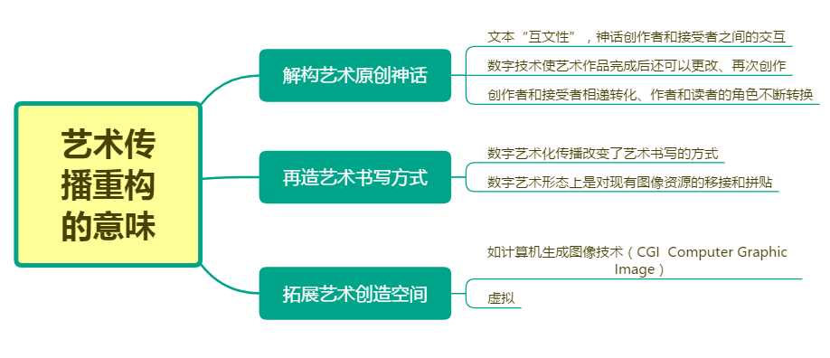

[TOC]

# 四章	传播的重构（一、四、五重点）

##	第一节	传播主体

一、创、传、受三位一体化

​	在传播链中受众的地位逐渐上升，成为传播链的核心，集创传受为一体，同时具有创作和传播的权力。

二、传播的”三位一体“层次

 +  从个体的角度看，数字技术的发展与推广使创传受整个过程变得非专业化。
 +  从传播者的角度看，数字时代的作品依赖于数字设备来运转的间接传播方式。
 +  从接受者的角度看，接受者不再被动，可以根据自己的喜好选择作品，具有互动性。
 +  从整体角度看，.数字技术的出现使艺术创作流程更加方便自由，任何人都可以独自完成创、传、受的整个过程；不同的内容和形式之间可以相互转换，如文字转声音，图片转视频，图片转文字。（**UGC、软件、APP**）

三、传播主体的”三位一体“的意义

​	从接受者的角度

   	1. 艺术创作者创作出一个数字艺术作品。没有把它传播出去，只是自我欣赏，那么就没有构成大众传播的模式，那么这只是自我传播。
   	2. 当作者将自己的作品通过数字平台传播出去时，有了受众欣赏这个作品，进行交流。创作者会第一时间收到回应，那么这个作者就变成了自己作品的**最终的接受者**。

传播方式两两相互

##	第二节	传播价值

##	第三节	传播条件

##	第四节	艺术传播重构的意味

####	#虚拟图像与过去感光图像相比具有的特点

1. 虚拟图像具有同步性甚至超前性。从电影美学的角度，数字技术接入产生的影片由两种性质完全不同的形态：一，虚拟的现实，在现实主义手法的领域内描绘现实、再造历史或真实再现某些自然景观和动作奇观；二、虚拟的非现实，描绘不可能发生或我们不可能看到的现实，没有现实生活的摹本。
2. 传统感光图像是二维图像，而虚拟图像是三维立体的。
3. 虚拟图像的原本与摹本都是虚拟的存在，是一种双向互动关系，现实中的画和其的摹本却是决定与被决定的。

**虚拟艺术形态的喊声极其深远的发展空间，我们似乎总能在现实生活中找到其原型的影子，但要比原型更深刻，它不仅是对原本的一种浓缩，或者更应该说是对原本的进一步演绎。**

##	第五节	艺术传播的重构效应

####	#数字化传播带来了“艺术平民化”发展的新契机，使艺术褪去“高贵华丽的外衣”，从传播学角度“数字化传播。一场艺术平民化革命”的特点：

1. 从前“隔行如隔山”，现在数字技术的广泛应用使艺术创作越来越方便自由，傻瓜式的操作降低了艺术创作的门槛，使众多交叉或不同行业的人有了涉足艺术领域的“敲门砖”。
2. 数字技术简化了艺术创、传、受的过程，很大程度上降低了艺术传播的成本。
3. 数字技术除了使更多的人参与到艺术传播的过程中来，还大大提高了大众的艺术审美能力。
4. 数字技术重构了艺术创作的新语境，并使其目的更趋现实性，创作者不再像过去那样自视清高。

#### #二次文本

二次文本是指艺术复制者复制的艺术文本，采用一种较为理性的传播方式。例如将曹雪芹的《红楼梦》由纸质手稿复制成电子书。

二次文本的价值：使得艺术作品获得了增量的、展示的、开放的特性。

####	#三次文本

是指艺术及作者二度创作的艺术文本。例如达芬奇《蒙娜丽莎》以不同的形象出现在广告设计中，长了胡须的蒙娜丽莎等。

####	#审美误读的合法化

1. 作品被转换成数字代码，从前材质质感给人的心灵带来的震撼、触动和感受没有了，所有作品被转化为同一数字符号
2. 原作被多次下载、转发，许多作品已与他最初的模样有显著区别

#### #文化批评缺位的原因

1. 掌握数字技术的人比较年轻，所受的教育更多是技术层面的知识，对所谓的文化深度不屑一顾，从技术方案来说可能行不通。
2. 新的技术层出不穷，要时刻关注和学习，使他们心有余而力不足，无法腾出时间进行宏观的文化背景价值的研究。

#### #如何重塑艺术之境？

一是“现实”，二是“创造”

前者通过数字技术消除艺术的精英高层性，使艺术真正为大众所掌握，真正成为民众的语言；后者则是于前者相辅相成，艺术回归大众。

艺术的数字化传播，不但要跟踪先进的数字技术，更要跟踪数字化艺术先进的创作观念，从而全面掌握艺术数字化传播的特性和精神。

数字技术对于艺术圈波的发展，总体而言是一把双刃剑。掌握得当，它将使艺术发展到一个崭新的高度；反之，历史的车轮不进则退。