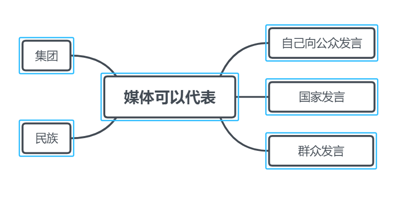

[TOC]

#  第一章	传媒语境的当代构成

第一章的主要内容为介绍传统媒体，如电视。第三节比较重点。

##  绪论

​	引用：需要研究当代传媒语境下的当代经济变化、当代文化变化，进而探讨语境成就现实，以及美学发展条件的主体化过程。

##  第一节	传媒语境形成的时代背景（全球化背景）

​	**“全球化”**脱胎于**传播学家麦克卢汉**的“地球村“概念。从”地球村“到”全球化“，说明了自电视出现以来多种传媒介的迅疾发展，同时也说明了多媒体的发展是一个过程，而非一蹴而就。多媒体技术的出现远非宣告多媒体时代的到来，当技术对人的文化、意识、生活造成影响后，这个时代就来临了（及文化的时代性取决于文化的人民性）。

​	在媒体技术更新换代的当代社会，**媒体传统被解构、被重构的方式**，才是我们解答传媒本性、明确其在基础、把握其发展规律的核心所在。

#### #为什么说移动互联网时代到来？

+ 据中国互联网信息中心（CNNIC）统计，截至2017年，我国网民规模达7.72亿，普及率达到55.8%。全年共计新增网民4074万人，增长率为5.6%，我国网民规模继续保持平稳增长。信息化服务快速普及、网络扶贫大力开展、公共服务水平显著提升，让广大人民群众在共享互联网发展成果上拥有了更多获得感。
+ 据中国互联网信息中心（CNNIC）统计，截至2017年，我国手机网民规模达7.53亿，网民中使用手机上网人群的占比同去年相比提高2.4个百分点。使用电视上网的网民比例也提高3.2个百分点，达28.2%；台式电脑、笔记本电脑、平板电脑的使用率均出现下降，手机不断挤占其他个人上网设备的使用。以手机为中心的智能设备，成为“万物互联”的基础，车联网、智能家电促进“住行”体验升级，构筑个性化、智能化应用场景。移动互联网服务场景不断丰富、移动终端规模加速提升、移动数据量持续扩大，为移动互联网产业创造更多价值挖掘空间 。

#### #冷媒介、热媒介

​	这是麦克卢汉提出的两个概念，“冷媒介”传递的信息少而模糊，在理解之际需要更多的感官和思维活动的配合。

​	“热媒介”传递的信息比较明确，接受者不需要动用更多的感官和思维活动就能理解。

​	例如，一张照片是清晰的，而一幅漫画中的形象比较模糊，需要人进行联想和思考。前者属于“热媒介”，而后者属于“冷媒介”。

​	 “热媒介”和“冷媒介”的分类本身并没有多少科学和实用价值，重要的是它给我们的启示：不同的媒介作用于人的方式不同，引起的心理和行为反应也各具特点，研究媒介应该把这些因素考虑在内。 

​	联想到《艺术学概论》“空白”的概念，伊赛尔用“空白”和“不确定性”来说明文本与接受者之间的关系，文本中有未写出的部分，是作者像向读者暗示的东西，需要读者运用自己的想象去填补。例如文学文本中的林黛玉形象，虽然文中有对样貌的描写，但是我们并不知道林黛玉的具体样子，但是在影视文本中，演员把她的外貌具体化了。

##  第二节	传媒语境构成的传统成分（以电视为代表的电视媒体的发展之路）

​	电视的出现初步实现了地球村。

#### #技术对人的异化（或者说对人文精神造成的负面影响）

+  **P73 第2、3段**   在这个被传媒压缩变小的空间里，人类的眼睛和耳朵获得了前所未有的解放，但同时，人类的大脑——精神世界也前所未有的被压缩——共同化为相似的集成模块了。当代媒在压缩了人与人之间的生存空间的同时，也很大程度上取消了空间距离所带了的人与人之间的生存差异。就像现在大家很容易同时感染一种疾病那样，我们了解一样的信息、我们鉴赏一样的艺术形式、我们关注一样的话题、我们消费一样的广告商品、我们崇拜一样的媒介明星——伴随着当代传媒给予我们的诸如此类的“同一”，我们的思维不得不趋同、我们的行为不得不趋同。
+ 因为媒体无处不在，我们的个性化已经被异化为时尚，而时尚即流行，流行即趋同，其结果：播种的是个性，收获的是雷同。目的地不仅偏离了出发点，甚至适得其反。
+ **马尔库塞《单向度的人》**技术对人的异化使人更加趋同，更加没有差别，不会思考。使人们丧失了自由和创造力，不再想像或追求与现实生活不同的另一种生活 

技术只是我们实现梦想的手段；如果说是技术直接创造了电视，那么直接创造技术的就是人类的想象力。（技术的地位，是人创造的）

#### #NHK

日本放送协会（简称NHK）是日本第一家根据《[放送法](https://baike.baidu.com/item/%E6%94%BE%E9%80%81%E6%B3%95/5826319)》而成立的大众传播机构 

#### #传统与反传统

传媒的发展就是不断的抛弃传统、创造新的现实，就是彻底的否定主义和彻底的创新主义相衔接的过程。而这一动态过程，就构成了美学发展预警的动态性——传统与反传统。

###  一、传媒蕴涵及其所引发的价值传统（传媒内容的价值）

**数字媒体不仅影响**着我们的思维方式，而且直接影响我们的思维方式，带来了所谓的**数字化生存**。

#### #《数字化生存》

作者**尼葛洛庞帝**，人类生存于一个虚拟的数字化的生存活动空间，在这个空间里，人们应用数字技术从事信息、传播、交流、学习、工作等活动。

###		二、传媒本体所形成的传播系统（传媒本质与目的就是传播）

#### #艺术价值的转变和流变（12年论述题）

+ 以前是展示价值、操控价值，以前的艺术作品是有光环的，现在的艺术作品不是
+ 从广泛的瞬时传播中可以看出现代媒体为了快速广泛地被接受，会寻找大众喜爱的方式去传播，也就是**受众现在的地位上升成为传播链的核心**（见一章三节二点），有可能会引发三俗作品的产生。
+ p77第二段  当代媒体艺术的这一价值实现管道，决定了其发展与存在传统的形成。当代媒体艺术的价值一方面与其品质有关，一方面与之被广泛的瞬时传播有关，即与发生与存在、接受与鉴赏的当下性有关。。。。。。

	##	 三、传媒所赖以运行的生存系统（讲的是媒介集团，了解内容）

#### #把关人

+ 媒体机构是媒体传播内容的制造者或至少是把关者。
+ 每个用户自己要有意识去当把关人。

#### #UGC

UGC（User Generated Content）是指用户原创内容，是一种用户使用互联网的新方式，即由原来的以下载为主变成下载和上传并重 。

### 四、传媒所制造的文化系统

不同的媒体机构性质决定了其不同文化理念导向。

市场文化的核心，是利益的最大化，要么追求社会利益的最大化、要么追求经济利益的最大化。现在的大多数媒体是公益和经济的结合体（见一章三节二点）。

### 五 、传媒内容的呈现传统亦即形式传统

​	媒体内容生产必然是按照城市标准的类型化身，类型同时体现了传媒艺术作为大众文化————消费文化的生产特点：

1. 任何媒体的内容都不可能是做给一个人看的（在这个时代会被颠覆，应该制作量大、质优的节目，让观众自主选择）。
2. 内容的传播方式要求其内容生产必须是高效率的，制作出来的内容要源源不断的送入播出或刊发机器，具有实时性。

##  第三节	传媒语境构成的当代成分（新媒体与传统媒体的对比）

​	数字时代的特性：**比特性**、**虚拟性**————————**尼葛洛庞帝**《数字化生存》

​	前一个时代定然是孕育下一个时代新技术思维的母体，我们现在的思维习惯一定能体现电视媒体时代的思维习惯。

​	时代的变化也许会从技术开始但最终会体现为我们观念上的革命，亦即我们的认识的发展才是时代的根本发展。技术改变是一个方面，但是最重要的是人的思维、意识形态的转变，比如像现在的互联网思维。

​	数字技术必然会从对传播媒介、生产方式的作用扩展到对我们意识形态，乃至生存方式的作用，这就是一个时代“当代性”的形成和表现。”当代性“一定孕育与传统性，反过来又作用于甚至颠覆、重构传统性。例如，互联网对电视受众观看习惯的颠覆，电视时代是定点观看，互联网时代是随时点播。

#### #互联网思维

​	互联网思维，就是在（移动）互联网+、大数据、云计算等科技不断发展的背景下，对市场、用户、产品、企业价值链乃至对整个商业生态进行重新审视的思考方式。 李彦宏提出，可能你做的事情不是互联网，但你的思维方式要逐渐从互联网的角度去想问题。 

###  一、现代传媒的技术“当代性”

### 二、现代传媒的制度“当代性”（即跨媒体经营的要求对专业化经营的质疑）

​	现代传媒的媒介制度不外乎**商业性（盈利）**和**公共性（公益）**两种。

​	p86第三章	大众的地位上升，人本精神回归。	数字时代下**传播链发生了改变，核心重新回归到人本**，这是一个很好的方面，因为任何事物人一定是核心。但是也会引发一些不好的东西的产生，因为人本身会有一些非常底层的欲望和需求，很多媒体抓住人的这一阴暗面，制造一些三俗作品，获取眼球，对整个艺术市场造成不好的影响。

#### #跨媒介经营（即媒介融合或媒体转变）见P94

​	在数字时代，追求的不是广播化或专业化，而是个人化合肥专业化。“开放系统”是一个至关重要的概念，传媒的数字时代生存，首先需要否决的即是自诩多年的技术上的专业性、垄断性与数字技术的开放性相融合。在数字时代，因为具有比特性，各媒体机构的边界逐渐消解，使融合成为可能。

+ 要找到适合自己的形式

3D电视频道的关闭

###  三、现代传媒的理念“当代性”（思维）

#### #资本主义制度下的媒体发展理念是

满足市场需要。

#### #社会主义制度下的媒体发展理念是

以宣传、教育功能的最大化为目的。

#### #“托拉斯“

资本主义垄断组织

#### #技术对人的异化

p90 第三段	约翰·奈斯比特。。。

#### #数字媒体艺术的本性	开放、自由、人本

+ 开放性	即要求传媒从技术到内容都应具备公众管理和使用的权限，自己充当把关人。媒体应该是技术和内容管理的终端，而非唯一的控制着，更不能是垄断者；在媒体上传播的内容不能只有媒体从业者来决定，公众应该有权决定看什么和怎样看。
+ 自由性     即要求媒体传播的自由和便利。受众能够以自身的存在的空间为标准接受媒体内容，而非以媒介所在的空间为标准接受媒体内容。
+ 人本性     待补充

